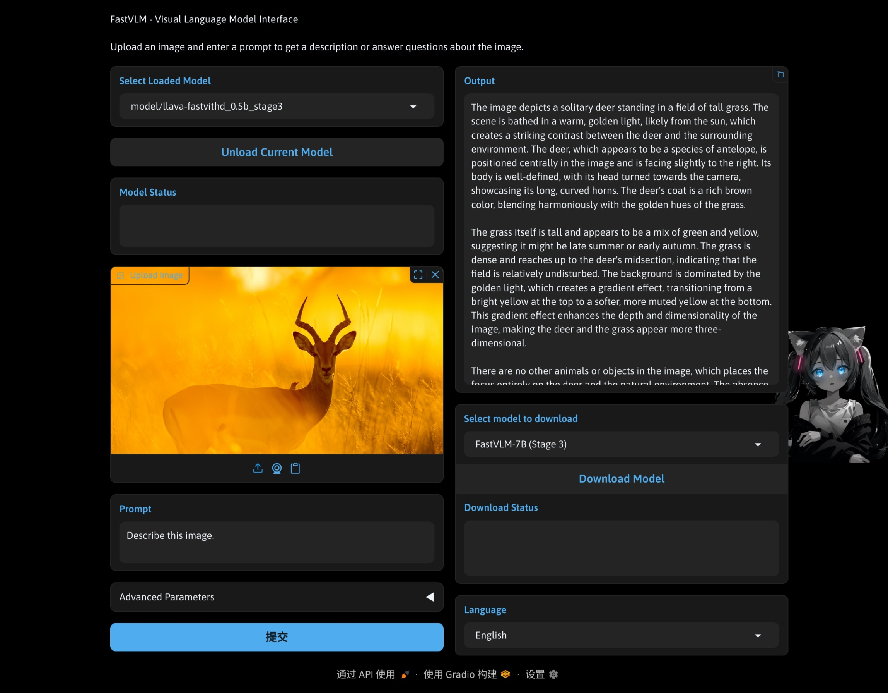

# FastVLM: Efficient Vision-Language Model

This is a streamlined version of the FastVLM repository, configured with a Gradio-based Web UI for image description. For complete details about the original project and research, please refer to:
**[FastVLM: Efficient Vision Encoding for Vision Language Models](https://www.arxiv.org/abs/2412.13303). (CVPR 2025)**

### Key Features

- FastVLM introduces FastViTHD, a novel hybrid vision encoder for efficiently processing high-resolution images with faster performance.
- This repository provides a Gradio Web UI (`app_fastvlm_ui.py`) for interacting with FastVLM models, featuring:
  - **Built-in Model Downloader**: Easily download and manage pre-trained models directly within the application.
  - **Automatic Device Selection**: Optimally utilizes available hardware (CUDA, MPS, or CPU).
  - **Multi-language Support**: Interface supports multiple languages (English, Chinese).
  - **Interactive Controls**: Adjust generation parameters like temperature, top-p, and beam search.
  - **API Server**: Provides a RESTful API interface for integration with other applications.

## Model List

The table below lists the available pre-trained FastVLM models. For detailed information on various evaluations, see the [paper](https://www.arxiv.org/abs/2412.13303).

| Model        | Stage |                                       Pytorch Checkpoint (url)                                        |
| :----------- | :---: | :---------------------------------------------------------------------------------------------------: |
| FastVLM-0.5B |   2   | [fastvlm_0.5b_stage2](https://ml-site.cdn-apple.com/datasets/fastvlm/llava-fastvithd_0.5b_stage2.zip) |
|              |   3   | [fastvlm_0.5b_stage3](https://ml-site.cdn-apple.com/datasets/fastvlm/llava-fastvithd_0.5b_stage3.zip) |
| FastVLM-1.5B |   2   | [fastvlm_1.5b_stage2](https://ml-site.cdn-apple.com/datasets/fastvlm/llava-fastvithd_1.5b_stage2.zip) |
|              |   3   | [fastvlm_1.5b_stage3](https://ml-site.cdn-apple.com/datasets/fastvlm/llava-fastvithd_1.5b_stage3.zip) |
| FastVLM-7B   |   2   |   [fastvlm_7b_stage2](https://ml-site.cdn-apple.com/datasets/fastvlm/llava-fastvithd_7b_stage2.zip)   |
|              |   3   |   [fastvlm_7b_stage3](https://ml-site.cdn-apple.com/datasets/fastvlm/llava-fastvithd_7b_stage3.zip)   |

## Installation

1.  **Clone the repository (if you haven't already):**
    ```bash
    git clone https://github.com/zdxiaoda/ml-fastvlm-webui
    cd ml-fastvlm-webui
    ```
2.  **Create a Python environment and activate it (e.g., using Conda):**
    ```bash
    conda create -n fastvlm_ui python=3.10 -y
    conda activate fastvlm_ui
    ```
3.  **Install dependencies:**
    This project requires Python 3.10 or higher.
    ```bash
    pip install -r requirements.txt
    # The following command installs the llava package from local directory
    # which is required for the application to work correctly.
    pip install -e .
    ```

## Usage Guide

### Web UI

Launch the Gradio web server:

```bash
python app_fastvlm_ui.py
```

Visit the displayed URL in your browser (typically http://0.0.0.0:7860).



### API Server

FastVLM provides a RESTful API for integration with other applications:

1. **Starting the API Server:**

   - Via Web UI: Navigate to the "API Settings" tab, configure host/port, and click "Start API Server"
   - Default: host=0.0.0.0, port=8008

2. **API Endpoints:**

   - **Image Description Generation:**

     ```bash
     curl -X POST http://localhost:8008/generate \
       -H "Content-Type: application/json" \
       -d '{
         "image_path": "/path/to/image.jpg",
         "prompt": "Describe this image",
         "temperature": 0.7,
         "top_p": 0.9,
         "num_beams": 1,
         "conv_mode": "v1"
       }'
     ```

   - **Parameters:**
     - `image_path`: Path to the image file (required)
     - `prompt`: Text prompt for image description (required)
     - `temperature`: Controls randomness (default: 0.2)
     - `top_p`: Controls diversity (default: 0.7)
     - `num_beams`: Number of beams for beam search (default: 1)
     - `conv_mode`: Conversation mode (default: "v1")
     - `max_new_tokens`: Maximum tokens to generate (optional)

3. **Stopping the API Server:**
   - Via Web UI: Click "Stop API Server" in the API Settings tab

## Citation

If you find the original FastVLM work useful, please cite their paper:

```
@InProceedings{fastvlm2025,
  author = {Pavan Kumar Anasosalu Vasu, Fartash Faghri, Chun-Liang Li, Cem Koc, Nate True, Albert Antony, Gokul Santhanam, James Gabriel, Peter Grasch, Oncel Tuzel, Hadi Pouransari},
  title = {FastVLM: Efficient Vision Encoding for Vision Language Models},
  booktitle = {Proceedings of the IEEE/CVF Conference on Computer Vision and Pattern Recognition (CVPR)},
  month = {June},
  year = {2025},
}
```

## Acknowledgements

This codebase builds upon multiple open-source contributions. See [ACKNOWLEDGEMENTS](ACKNOWLEDGEMENTS) in the original project for more details.

## License

Before using the provided code, please review the repository [LICENSE](LICENSE) and [LICENSE_MODEL](LICENSE_MODEL) for the released models (as applicable to the models you download).
